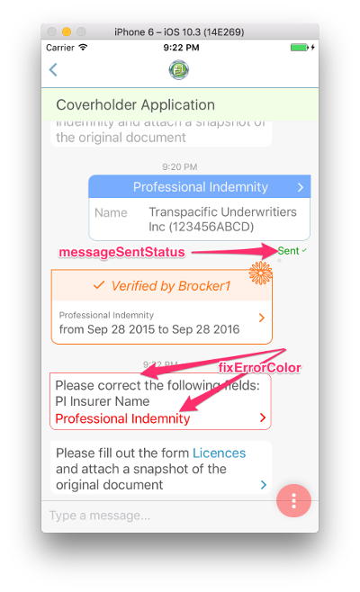
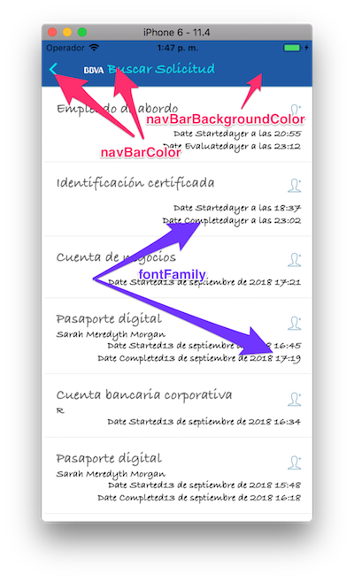

# @tradle/bot-style-me

## Usage

Set the correct provider URL in [conf.json](./conf.json)

```sh
yarn start
```

Along with your other strategies:

```js
const styleMe = require('@tradle/bot-style-me')
bot.use(styleMe)
```

## Styles

Currently only colors are exposed for modification. Here are some of the ones you can change. How? Talk to the Style Me bot to find out :)






